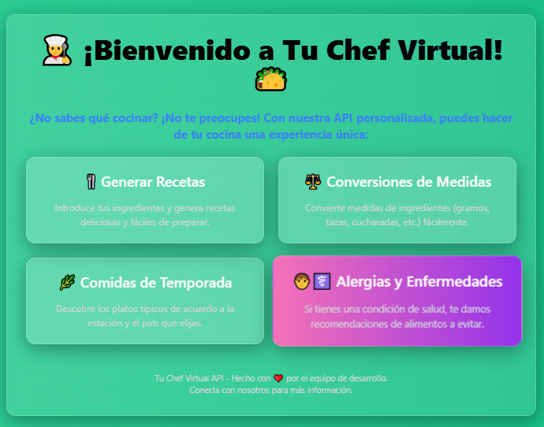
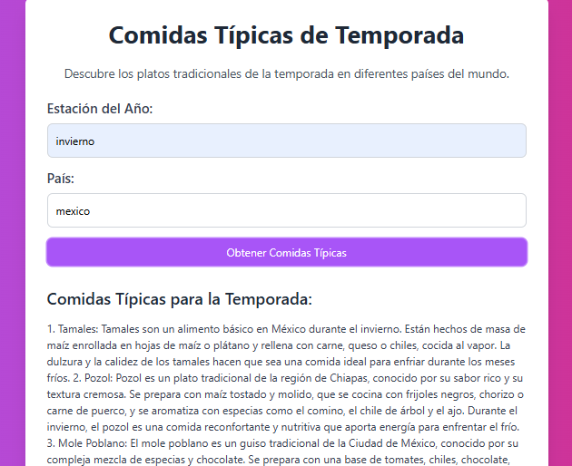

# Chef Virtual - API de Cocina Inteligente

¡Bienvenidos a **Chef Virtual**, una API innovadora que te ayudará a resolver problemas culinarios, generar recetas deliciosas, convertir medidas, sugerir comidas según la temporada, y más! 🌟🍽️




## Descripción

**Chef Virtual** es una API desarrollada con **FastAPI** que permite a los usuarios interactuar con diversas funcionalidades relacionadas con la cocina a través de consultas sencillas. Usa tecnología de procesamiento de lenguaje natural de modelos avanzados de Hugging Face para ofrecer recomendaciones, generar recetas y ayudar en la conversión de unidades. 

### Funcionalidades

1. **Generación de recetas**: Basado en una lista de ingredientes proporcionada por el usuario, la API genera una receta con pasos detallados y un consejo especial para mejorar el plato.
2. **Resolución de problemas culinarios**: ¿Tu comida está demasiado salada, picante o ácida? La API te ayuda a solucionar problemas comunes en la cocina.
3. **Conversión de medidas**: La API puede convertir unidades de medida comunes (como tazas a gramos).
4. **Recomendaciones de comidas de temporada**: Sugerencias de platos típicos según la estación del año y el país elegido.
5. **Recomendaciones según condiciones de salud**: Basado en condiciones de salud comunes (como celiaquía, diabetes, etc.), la API sugiere alimentos recomendados y aquellos a evitar.



## Tecnologías utilizadas

- **FastAPI**: Framework para la creación de la API.
- **Hugging Face API**: Utilizado para la generación de recetas y procesamiento de lenguaje natural.
- **Langchain**: Herramienta para interactuar con Hugging Face a través de `PromptTemplate`.
- **Python-dotenv**: Para manejar las variables de entorno de manera segura.
- **PyMySQL**: Para la conexión con bases de datos MySQL.
- **Uvicorn**: Servidor ASGI para ejecutar la aplicación FastAPI.
- **Jinja2**: Motor de plantillas para renderizar las respuestas HTML.

## Requisitos

- Python 3.8 o superior
- Una cuenta en Hugging Face para obtener la API Key
- Un servidor de base de datos MySQL para almacenar los logs de las recetas generadas

## Instalación

1. **Clona el repositorio**

   ```bash
   git clone <URL_DEL_REPOSITORIO>
   cd <directorio_del_proyecto>


2. **Usando Docker**

Si prefieres una instalación más rápida y sin configuración manual, puedes usar la imagen disponible en Docker Hub.

1. **Descargar la imagen**

   Ejecuta el siguiente comando para descargar la imagen desde Docker Hub:

   ```bash
   docker pull javierro97/chef_agent:V4

   docker run --env-file .env -p 8000:8000 -t javierro97/chef_agent:V4